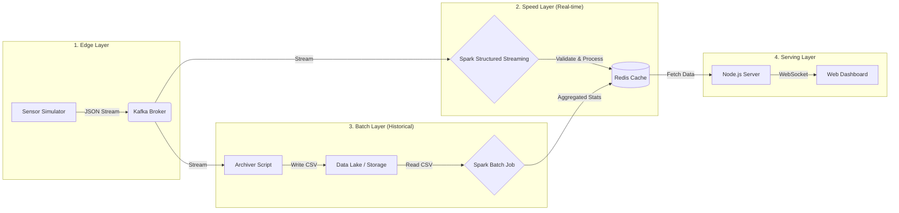

# 🏥 Real-Time Health Monitoring System (Lambda Architecture)

A scalable **IoT Big Data Healthcare System** designed to monitor Diabetes (Glucose) and Heart Rate in real-time. This project implements the **Lambda Architecture** to handle massive data streams with low latency while simultaneously archiving data for historical analysis.

---

## 🧠 System Architecture

The system follows the Lambda Architecture pattern, divided into three main layers: **Speed Layer** (Real-time), **Batch Layer** (Historical), and **Serving Layer** (Dashboard).

✨ Key Features
⚡ Real-Time Visualization: Live streaming graph (Last 60 seconds) for Glucose trends via WebSockets.

🛡️ Business Logic Validation: Automatically filters & drops invalid sensor data (e.g., negative heart rates, impossible glucose levels) to ensure data integrity before processing.

🚨 Smart Alerts: Real-time status classification (NORMAL, WARNING, CRITICAL_HIGH, CRITICAL_LOW).

💾 Data Lake Archiving: Stores raw sensor data into CSV files for audit trails and deep learning.

📊 Batch Analytics: On-demand calculation of daily statistics (Average, Min, Max, Total Records) from the Data Lake.

🧹 Auto-Initialization: Includes a script to clean the database and prepare the environment instantly.

---

🛠️ Tech Stack
Component,Technology,Description
Ingestion,Apache Kafka,Message Broker for high-throughput data streaming.
Processing,PySpark (Spark 3.x),Engine for both Streaming (Speed) and Batch processing.
Storage,Redis Stack,In-memory database for sub-millisecond dashboard updates.
Data Lake,Local Filesystem,Raw storage in CSV format.
Backend,Node.js + Socket.io,Serves data to the frontend via WebSockets.
Frontend,HTML5 + Chart.js,Responsive dashboard for visualization.
