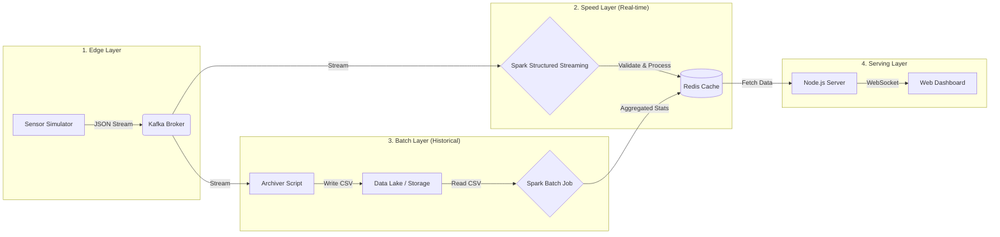

# 🏥 Real-Time Health Monitoring System (Lambda Architecture)


A scalable **IoT Big Data Healthcare System** designed to monitor Diabetes (Glucose) and Heart Rate in real-time. This project implements the **Lambda Architecture** to handle massive data streams with low latency while simultaneously archiving data for historical analysis.

---

## 🧠 System Architecture

The system follows the Lambda Architecture pattern, divided into three main layers: **Speed Layer** (Real-time), **Batch Layer** (Historical), and **Serving Layer** (Dashboard).



---

## ✨ Key Features

- **⚡ Real-Time Visualization:**  
  Live streaming graph (Last 60 seconds) for Glucose trends via WebSockets.

- **🛡️ Business Logic Validation:**  
  Automatically filters & drops invalid sensor data (e.g., negative heart rates, impossible glucose levels) to ensure data integrity before processing.

- **🚨 Smart Alerts:**  
  Real-time status classification (`NORMAL`, `WARNING`, `CRITICAL_HIGH`, `CRITICAL_LOW`).

- **💾 Data Lake Archiving:**  
  Stores raw sensor data into CSV files for audit trails and deep learning.

- **📊 Batch Analytics:**  
  On-demand calculation of daily statistics (Average, Min, Max, Total Records) from the Data Lake.

- **🧹 Auto-Initialization:**  
  Includes a script to clean the database and prepare the environment instantly.

---

## 🛠️ Tech Stack

| Component | Technology | Description |
| --- | --- | --- |
| **Ingestion** | Apache Kafka | Message Broker for high-throughput data streaming. |
| **Processing** | PySpark (Spark 3.x) | Engine for both Streaming (Speed) and Batch processing. |
| **Storage** | Redis Stack | In-memory database for sub-millisecond dashboard updates. |
| **Data Lake** | Local Filesystem | Raw storage in CSV format. |
| **Backend** | Node.js + Socket.io | Serves data to the frontend via WebSockets. |
| **Frontend** | HTML5 + Chart.js | Responsive dashboard for visualization. |

---

## ⚙️ Prerequisites

Pastikan Anda sudah meng-install:

1. **Docker Desktop** (untuk container Kafka & Redis)
2. **Python 3.8+**
3. **Node.js & npm**
4. **Java JDK 8 atau 11** (dibutuhkan oleh Apache Spark)

### Install Python Libraries

```bash
pip install kafka-python pyspark redis pandas numpy
```

---

## 🚀 How to Run (Step-by-Step)

Untuk menjalankan full system, buka **6 terminal terpisah**. Ikuti urutan berikut agar tidak terjadi error koneksi.

### Step 0: Infrastructure & Initialization (Start Here)

1. Pastikan container Docker (Kafka, Zookeeper, Redis) sudah **RUNNING**.
2. Jalankan script inisialisasi untuk membersihkan Redis dan membuat folder penyimpanan:

```bash
cd 4-Batch-layer
python init_db.py
```

_Output: `✅ Redis Bersih! ... 🚀 SISTEM SIAP DIJALANKAN!`_

---

### Step 1: Ingestion Layer (The Bridge)

Menjembatani Python producer ke Kafka topic.

```bash
cd 2-ingestion-layer
python kafka_bridge.py
```

---

### Step 2: Batch Layer (The Archiver)

Menyimpan raw data ke file CSV (Data Lake).

```bash
cd 4-Batch-layer
python archiver.py
```

---

### Step 3: Speed Layer (The Processor)

Menjalankan Spark Streaming job.  
> **Catatan:** Jika terjadi error, hentikan script ini dan hapus folder `checkpoint` di dalam `3-processing-layer`.

```bash
cd 3-processing-layer
python spark_speed_layer.py
```

---

### Step 4: Serving Layer (The Dashboard)

Menjalankan web server Node.js.

```bash
cd 5-serving-dashboard
npm install   # Jalankan sekali saja untuk install dependencies
node server.js
```

---

### Step 5: Edge Layer (The Sensor)

Menjalankan generator dummy sensor data.

```bash
cd 1-edge-layer
python sensor_dummy.py
```

---

### Step 6: Access the Dashboard

Buka browser (Chrome/Edge) dan akses:  
👉 **http://localhost:3000**

---

## 📊 Running Historical Analysis (Batch Job)

Bagian **"Daily Analysis"** (Avg/Max/Total) di dashboard **tidak** otomatis ter-update.  
Ia membutuhkan Batch Job yang membaca data CSV yang sudah dikumpulkan.

1. Biarkan sistem berjalan **1–2 menit** agar `archiver.py` mengumpulkan cukup data.
2. Buka terminal baru dan jalankan:

```bash
cd 4-Batch-layer
python spark_batch_job.py
```

3. Refresh dashboard untuk melihat statistik yang sudah ter-update.

---

## 📂 Project Structure

```text
diabetes-iot-project/
├── 1-edge-layer/
│   └── sensor_dummy.py        # Generates JSON data with random noise
├── 2-ingestion-layer/
│   └── kafka_bridge.py        # Pushes data to Kafka topic 'health_stream'
├── 3-processing-layer/
│   ├── spark_speed_layer.py   # Stream processing & Business Validation
│   └── checkpoint/            # Spark state (Delete this if code changes)
├── 4-Batch-layer/
│   ├── archiver.py            # Saves Kafka stream to CSV
│   ├── spark_batch_job.py     # Calculates stats from CSV
│   ├── init_db.py             # Clears Redis & prepares folders
│   └── data/storage/          # CSV files stored here (Data Lake)
└── 5-serving-dashboard/
    ├── server.js              # Node.js Backend
    └── public/
        └── index.html         # Frontend with Chart.js
```

---

## 🐛 Troubleshooting

### Graph kosong / tidak bergerak

- Pastikan `sensor_dummy.py` sedang berjalan.
- Pastikan `spark_speed_layer.py` berjalan tanpa error.
- Jika masih bermasalah:  
  Stop Spark, hapus folder `checkpoint` di `3-processing-layer`, lalu jalankan lagi Spark.

### Redis Connection Error

- Cek nama container Redis dengan `docker ps`.  
- Jika nama host bukan `redis-stack` atau bukan `localhost`, update konfigurasi host di:
  - `spark_speed_layer.py`
  - `server.js`

### Batch Job "Path not found"

- Artinya `archiver.py` belum menyimpan data apa pun.
- Biarkan sistem berjalan minimal **1 menit** lalu jalankan lagi:

```bash
python spark_batch_job.py
```

---

## 📜 License

This project is created for educational purposes in Big Data & IoT Architecture.
```
